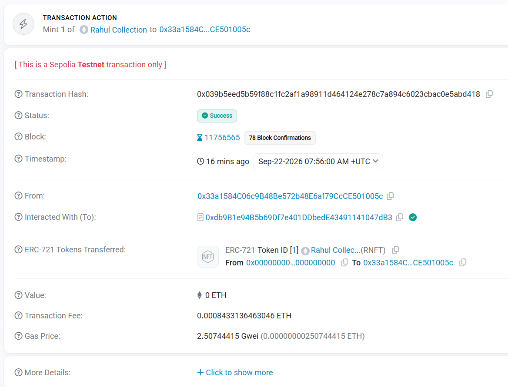
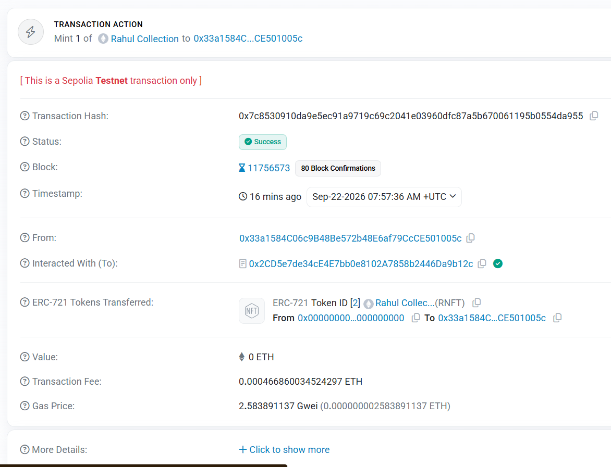
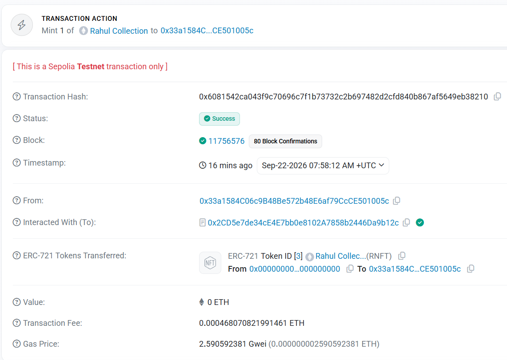
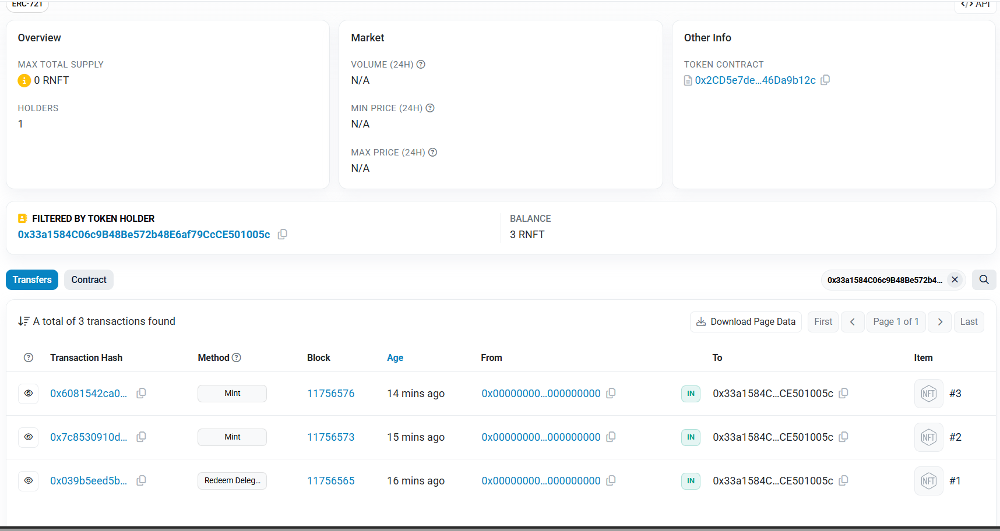
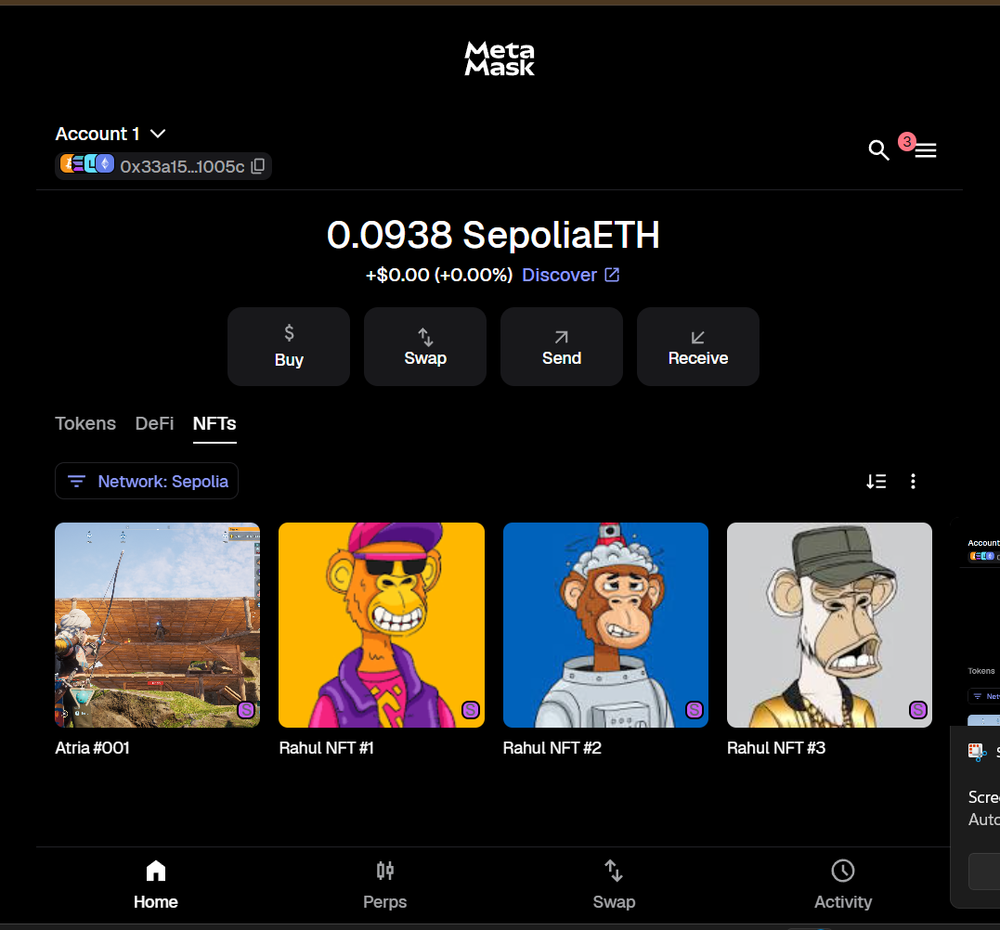

# Session 06 — Build & Deploy Your Own NFT Contract
**Name:** Rahul A
**Enrolment ID:** AU24UG-046
**Date submitted:** 22/09/2026
## 1. What this contract does
This contract implements an ERC-721 NFT collection called Rahul Collection
(RNFT). The owner can mint NFTs to any address by providing a tokenURI —
a link to the token's metadata stored on IPFS. Each token has a unique ID
starting from 1 and a distinct URI pointing to its own JSON metadata file.
Ownership of each token is tracked on-chain and verifiable by anyone.
## 2. Design decisions

**ERC721URIStorage over plain ERC721**: I used the URIStorage extension
because it stores a unique URI per token in a mapping. With
URIStorage each token can point to a different IPFS file, which
is what this assignment requires.

**Token IDs start at 1**: I increment `tokenId` before minting rather than
after. This means the first token is ID 1, not ID 0.

**`_safeMint` over `_mint`**: `_safeMint` checks that if the recipient is a
contract, it implements `IERC721Receiver`. This prevents NFTs from being
permanently locked in a contract that can't handle them.

**IPFS for metadata**: Metadata is stored on IPFS rather than on-chain
because storing strings on Ethereum is expensive. IPFS is content-addressed
— the URI only resolves if the file hasn't been tampered with, which gives
verifiable permanence.

## 3. Deployment
- Network: Sepolia Testnet
- Contract address: 0x2CD5e7de34cE4E7bb0e8102A7858b2446Da9b12c
- Transaction hash: 0x888be1d8e17b3a73f84d2e0b09d6b8ab10d9dfb52cf7e8c86db277719932e0a4 
- Block explorer link: https://sepolia.etherscan.io/tx/0x888be1d8e17b3a73f84d2e0b09d6b8ab10d9dfb52cf7e8c86db277719932e0a4
## 4. How to test it
Deploy from Account 1 (owner).

1. Call `mint(<your address>, "ipfs://QmABC.../nft1.json")` → returns `1`
2. Call `mint(<your address>, "ipfs://QmDEF.../nft2.json")` → returns `2`
3. Call `mint(<your address>, "ipfs://QmGHI.../nft3.json")` → returns `3`
4. Call `totalMinted()` → returns `3`
5. Call `ownerOf(1)` → returns your wallet address
6. Call `ownerOf(2)` → returns your wallet address
7. Call `tokenURI(1)` → returns `"ipfs://QmABC.../nft1.json"`
8. Call `tokenURI(2)` → returns `"ipfs://QmDEF.../nft2.json"` (distinct from token 1)
9. Switch to Account 2. Call `mint(<address>, "ipfs://...")` → reverts
   with `"OwnableUnauthorizedAccount"`. ← expected failure
10. Call `ownerOf(99)` → reverts with `"ERC721NonexistentToken"`. ←
    expected failure

Block explorer link(mint1): https://sepolia.etherscan.io/tx/0x039b5eed5b59f88c1fc2af1a98911d464124e278c7a894c6023cbac0e5abd418

Block explorer link(mint2): https://sepolia.etherscan.io/tx/0x7c8530910da9e5ec91a9719c69c2041e03960dfc87a5b670061195b0554da955

Block explorer link(mint3): https://sepolia.etherscan.io/tx/0x6081542ca043f9c70696c7f1b73732c2b697482d2cfd840b867af5649eb38210

Mint transactions Hash:
1. 0x039b5eed5b59f88c1fc2af1a98911d464124e278c7a894c6023cbac0e5abd418
2. 0x7c8530910da9e5ec91a9719c69c2041e03960dfc87a5b670061195b0554da955
3. 0x6081542ca043f9c70696c7f1b73732c2b697482d2cfd840b867af5649eb38210

IPFS Metadata Link: 
NFT1: https://magenta-electrical-cow-414.mypinata.cloud/ipfs/bafkreibcnlnv5sbywhucedjfofkk6m452ymhmeyiwwzro4xb7vudibtvne
NFT2: https://magenta-electrical-cow-414.mypinata.cloud/ipfs/bafkreiaxrcraww4wuq2xtrqxc3jqlyi22dbzyhdqtdwsay233zieivritm
NFT3: https://magenta-electrical-cow-414.mypinata.cloud/ipfs/bafkreigi6kocclmxqoyrd4d2ws7iq6fiys76q6e6e3bcym62dd5exnmcwu

## 5. What I found difficult
Setting up IPFS metadata was new — understanding that the image CID and the
metadata JSON CID are two separate uploads, and that the JSON references the
image CID inside it. Getting the order right (upload image first, get its
CID, put that CID in the JSON, then upload the JSON) took a moment.

## 6. Acknowledgements

OpenZeppelin Contracts v5 — ERC721URIStorage and Ownable
MetaMask Documentation
Pinata (pinata.cloud) used for IPFS uploads
Consulted Claude to understand the working of the contract and to understand Solidity concepts.
